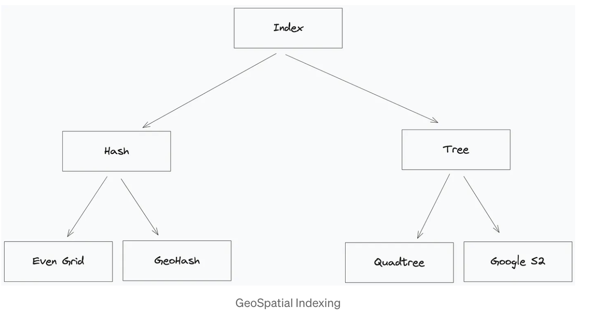

# Location Tracking System

References:
- **Imp** [School Bus Tracker System Architecture](https://medium.com/@joudwawad/school-bus-tracker-system-architecture-6dd3307e3860)

- Real time location can be updated using WebSockets from Bus to Servers
- 4 Types of Geo Indexing techniques. Geo Indexing can convert 2D (Lat, Long) to 1D 

- QuadTree: Divide region in 4 Parts until required criteria (Like no. of shops < 100) are met
    - Its an in-memory Tree data structure
- Google S2
    - In-memory solutio provided by Google library
    - Good for Geo fencing solutions