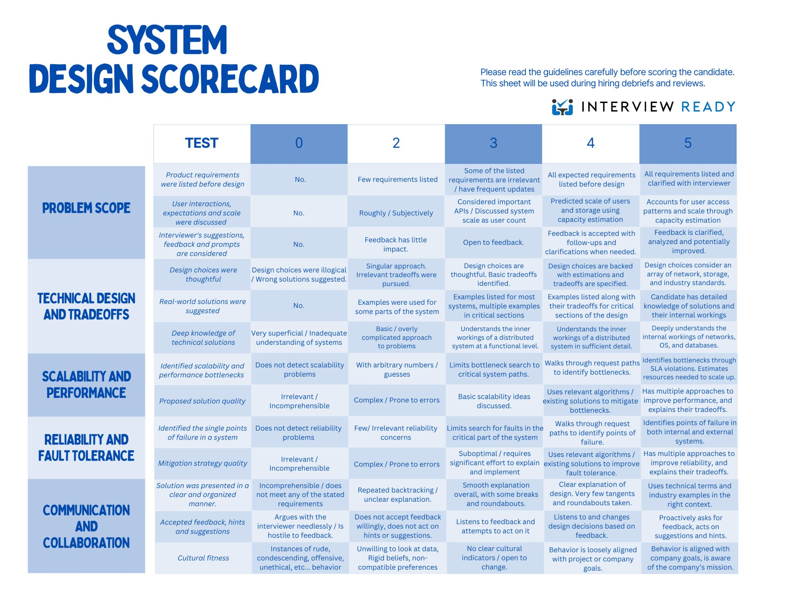

System design interviews are typically 45 minutes excluding introduction and other related questions.

If we are aware of specific step by step approach and ideal time we can spend on each section then interview can bring best out of your knowledge.

Inspired by [Hello Interview's](https://www.hellointerview.com/) framework listing down common sequencial approach.

1. [System Requirements](#system-requirements)
..

# System Requirements

## Functional Requirements
- Features of the system
- It should start with **User should be able to..**

## Non functional Requirements

- See what Non functional requirement makes particular **problem unique**
- Start with CAP theorem and decide on CP vs AP whats more important.
- Check R:W Ratio

## Back of the Envelop Estimations
- Do only if required.
- Can ask interviewer if this is required. This consumes time and might not be meaningful all the time.
- Can do if result of calculation has direct influence on design  

|Zeroes|Traffic|Storage|
|--|--|--|
|3|Thousand|KB|
|6|Million|MB|
|9|Billion|GB|
|12|Trillian|TB|
|15|--|PB|

## Core Entities

- It helps to get understanding of what data will be persisited in system and exchanged by the APIs.
Mention core entities of system. Like for online Judge it would be
1. user
2. Problem
3. Submission
4. Leaderboard
5. Competition

## API or Interface

- This will be user facing public APIs
- It will solve our Functional requirements and Core Entity data flow
- Mention REST APIs for each of the functional requirements

## Data Flow (For Platform Design Questions)

## High level design

- Focus on Functional Requirements mentioned earlier as discussed with Interviewer
- Just try to build a system that satisfies those functional requirements and try to avoid any distractions (distraction -> not part of Fn requirements)
- 

## Deep dive

## Other Resources

# InterviewReady Guide

# Other Resources
- [Mastering Microsoft system design interview as software engineer
](https://grokkingtechinterview.com/mastering-microsoft-system-design-interview-as-software-engineer-3089096f317e)