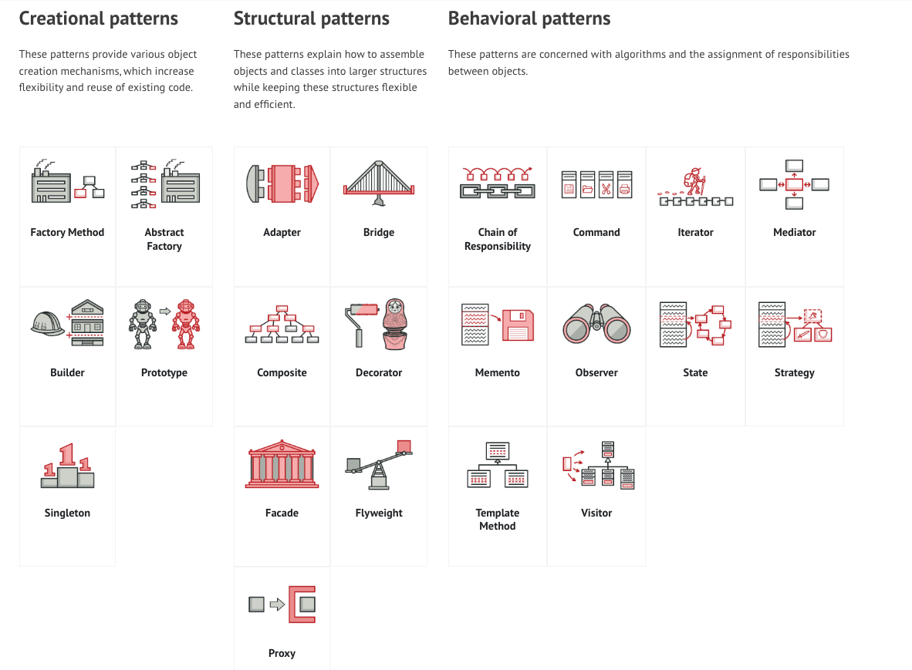

# Overview
* SOLID Principle
* Design Patterns
    * Creational Patterns
        1. **Factory** : creates and returns a new obj based on argument
        2. Abstract Factory : factory of factory
        3. **Builder** : Builds complex object 
        4. Prototype : to create duplicate object
        5. **Singleton** : Single object of a class.
    * Structural Patterns : How more than one class/objects are structured
        1. **Adaptor**
        2. Bridge
        3. Composite
        4. Decorator
        5. facade
        6. Flyweight
        7. Proxy
    * Behavioral Patterns : How more than one objects communicate with each other
        1. Chain of Responsibility
        2. Command
        3. Iterator
        4. Interpreter
        5. Mediator
        6. Memento
        7. **Observer**
        8. **State** : When system can have multiple states
        9. **Strategy**
        10. Template
        11. Visitor


Credits: https://refactoring.guru/design-patterns/catalog

# SOLID Principle
https://www.freecodecamp.org/news/solid-principles-single-responsibility-principle-explained/

## Single Responsibility
- A class should have only one reason to change. 
- Class should have only 1 purpose - **Applies to class**
- Exa: class should not be doing hashing as well as save to file operation

https://en.wikipedia.org/wiki/Single-responsibility_principle

## Open close Principle
- The open-closed principle states that software entities should be open for extension, but closed for modification.  **Applies to class**
- If we have a password hasher and adding new pass hasher algo, then it should be such that adding new algo do not change existing class as well as adding new algo should be easily expandable such than min no of code needs to be written
- Feel free to **extend** our classes with any new behavior you like. If your needs or requirements change (and we know they will), just go ahead and make your own extensions.
- Sorry, we’re **closed**. That’s right, we spent a lot of time getting this code correct and bug free, so we can’t let you alter the existing code. It must remain closed to modification. If you don’t like it, you can speak to the manager.
- Our goal is to allow classes to be easily extended to incorporate new behavior without modifying existing code. What do we get if we accomplish this? Designs that are resilient to change and flexible enough to take on new functionality to meet changing requirements.
- **Decorator pattern** is an example of  this principle


## Liskov substitution principle
- **Applies on subclass - inheritance**
- Each subclass should be substitutable for its parent class. It should **only extend its functionality rather than overriding** it…
- Like Square should not be subclass of Rectangle since it does not have properties called width and height. For square both are same. So rather it should be a parallel class not inherited one.
- The Liskov substitution principle simply implies that when an instance of a class is passed/extended to another class, the inheriting class should have a use case for all the properties and behavior of the inherited class.

## Interface segregation Principle
- segregate interfaces as much as possible. **Applies to interfaces**
- It should not force the class to implement things which are not required.
- The interface segregation principle states that the interface of a program **should be split** in a way that the user/client would only have access to the necessary methods related to their needs.

## Dependency inversion principle
- **Woks for Composition**
- Components should be dependent on abstraction(Interfaces) rather than concrete classes. i.e, Class should not load concrete class and then call its method. Rather it should have variable like IHasher which is interface/abstract class and then call IHasher.hashPw() so that - IHasher can have multiple hashing algorithms and adding/ deleting algorithm do not require our class to change implementations
One of the way to achieve this is Factory pattern

# Design Patterns In Depth

## Creational Patterns
Provides **object creation** patterns.

### Factory pattern
A factory pattern is a creational pattern. Put another way, a factory pattern is used to create objects of a specific type. A strategy pattern is use to perform an operation (or set of operations) in a particular manner

### Abstract Factory pattern 
Factory of factory

### Builder pattern
If you find yourself in a situation where you keep on adding new parameters to a constructor, resulting in code that becomes error-prone and hard to read, perhaps it's a good time to take a step back and consider refactoring your code to use a Builder.

### Prototype design pattern
In the prototype pattern, cloning is delegated to the actual objects being cloned.
Basically concrete class implements Cloneable interface and overrides clone method.
Clients need not worry when references object using interface/abstract class which actual object being copied. 

### Singleton design pattern

## Structural Patterns
These patterns explain how to assemble objects and classes into larger structures while keeping these structures flexible and efficient.

### Proxy pattern:
Useful to wrap out main method from client and put explicit sanity checks/ validations

## Behavioral patterns
These patterns are concerned with algorithms and the assignment of responsibilities between objects.

### Strategy Pattern
Deciding behavior class based on strategy.
A strategy pattern is an **behavoral pattern**.
Definition as per Head First
> The Strategy Pattern defines a family of algorithms, encapsulates each one, and makes them interchangeable. Strategy lets the algorithm vary independetly from clients tha use it.

Examples:
Lets say client application need to perform cloud upload operations.\
The upload can be done via Azure, AWS, Google or any Data storage service based on requirement. \
In this case a different upload is considered as **Upload Strategy** which should be abstracted out from client.

In the below example client class need not worry about addition of new strategy or change in any of the strategy of File Upload.

```java
/* Client class */
class ProcessData {
 IFileupload fileUpload; // Coding to an abstraction rather than implementation

 void process(FileUploadRequest request, FileUploadServices fileUploadService){
    fileUpload = FileUploadStrategies.get(fileUploadService).upload();
 }
}

enum FileUploadService { AWS, AZURE, GOOGLE}

class IFileupload { void upload(FileUploadRequest request); }
class AzureFileUpload implements IFileupload{
    void upload(FileUploadRequest request);
}
class AWSFileUpload implements IFileupload{
    void upload(FileUploadRequest request);
}
class GoogleCloudFileUpload implements IFileupload{
    void upload(FileUploadRequest request);
}

/**
 * This class returns strategy based on request
 * **/
class FileUploadStrategies {
    void get(FileUploadService service){
        switch(service) {
            case AWS:
                return new AWSFileUpload();
                break;
            case AZURE:
                return new AzureFileUpload();
                break;
            case GOOGLE:
                return new GoogleCloudFileUpload();
                break;        
        }
    }
}

```

### Observer Pattern
One data source object notifies all observers regarding data change. Observers can be added and removed at any time
Here subject and observers are loosely coupled.

### Decorator Pattern
Attaches additional responsibility to object at run time
When to use: some set of concrete classes can use a combination of additional features or functionality which can be added at run time.
It wraps concrete class and becomes wrapper to it by adding its own functionality like 
Pizza pizza = new CheeseToppings(new Margarita())
Cons: Adds lot more small sub classes
Example:


## Command Design Pattern
TODO

## State Design Pattern
Can use this when your system have multiple states and multiple events on same state
Can create interface of State with possible functionalities/event at each state
Avoids multiple if-else conditions

# Important LLD concepts

## Coupling
The knowledge or dependency each class has about other classes. This should be minimum. 

## Cohesion
Degree of similarities
Cohesion refers to the level of a component which performs a single well-defined task
The java.io package is a highly cohesive package because it has I/O related classes and interface. However, the java.util package is a weakly cohesive package because it has unrelated classes and interfaces.

## Association
Association represents the relationship between the objects.
1:1
1:many
many:1
many:many

## Aggregation
Aggregation is a way to achieve Association. Aggregation represents the relationship where one object contains other objects as a part of its state. 
It represents the weak relationship between objects.
It is also termed as a has-a relationship in Java. 
Like, inheritance represents the is-a relationship. It is another way to reuse objects.

## Composition
Way to achieve association
Strong relationship between objects
Child object can not exist without a parent object.
Has-a relationship. Board has pieces
Inheritance
Is-a relationship
Engineer is-a employee.

Object based programming language
Object-based programming language follows all the features of OOPs except Inheritance. JavaScript and VBScript are examples of object-based programming languages.
When the type of the object is determined at compile time(by the compiler), it is known as static binding.
When the type of the object is determined at run-time, it is known as dynamic binding.
Think about concurrency in LLD interview

# Notes
1. In LLD Interview…
    - First identity entities… like players, board, snack, ladder
    - Separate out Models ← data and Services ← logical part
    - Don't directly jump to code.
    - Think about the behaviors of entities
    - Checking our common behaviors and specific behaviors also helps identifying Interfaces and inheritance
    - See Inheritance vs Composition
2. Identify the aspects of your application which varies and separate them from what stays the same
    - Take the part that varies and encapsulate them so that later that part can be changed independently.
3. Program to an interface, not an implementation
    - It doesn't mean to use java Interface only but rather use supertype of the behavioral classes usually abstract class or Interface
        ```java
            class NonPreferredImplmentation {
               SHAHashAlgorithm shaHashAlgo;
            }

            class RecommendedImplementation {
                IHashAlgorithm hashAlgorithm;
            }

            class SHAHashAlgorithm implementa IHashAlgorithm {}
        ```
4. Favor composition over inheritance.
    - Has-A can be better than Is-A
    - 

# References
- LLD primer: https://github.com/prasadgujar/low-level-design-primer/blob/master/solutions.md
- Command Design Pattern : https://medium.com/@learncsdesign/learn-the-command-design-pattern-60cad5b85e34
- https://www.tutorialspoint.com/design_pattern/
- https://refactoring.guru/design-patterns/catalog


