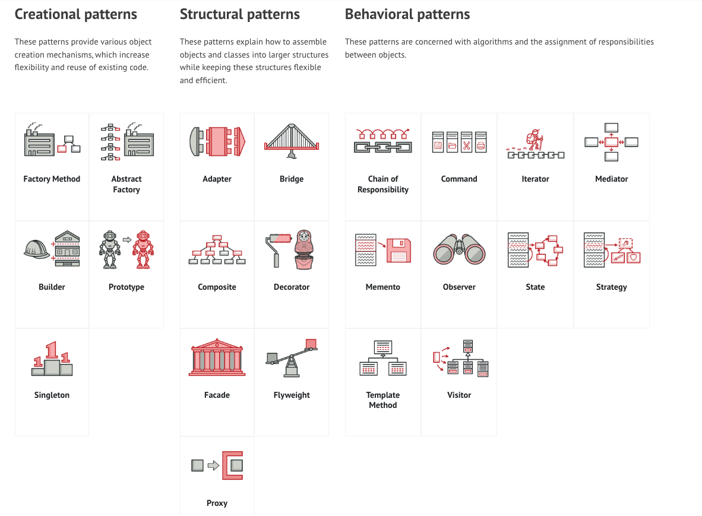
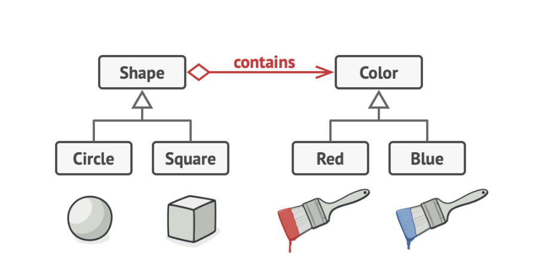
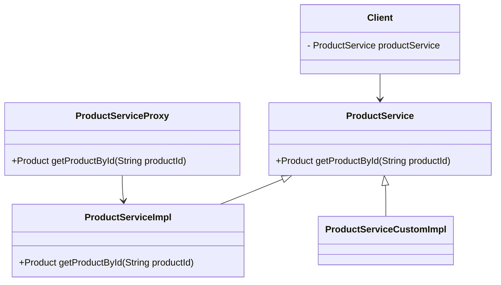
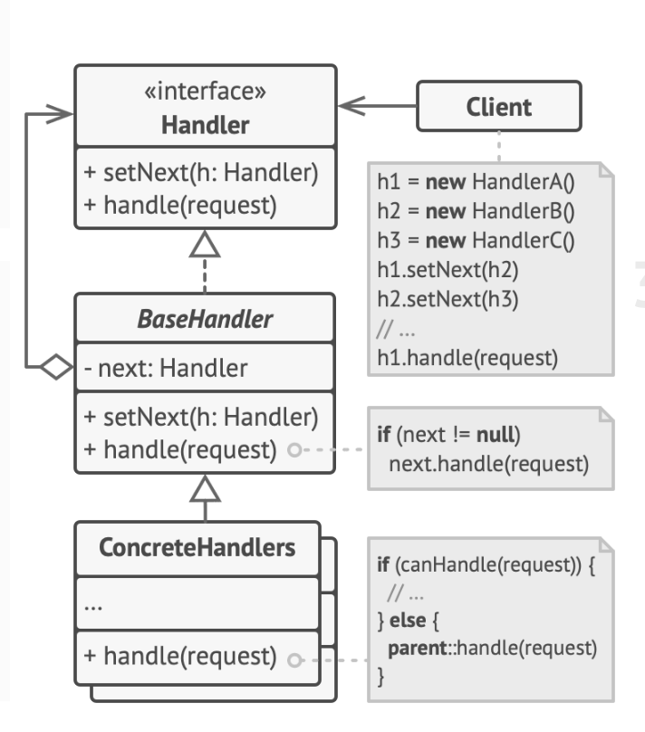
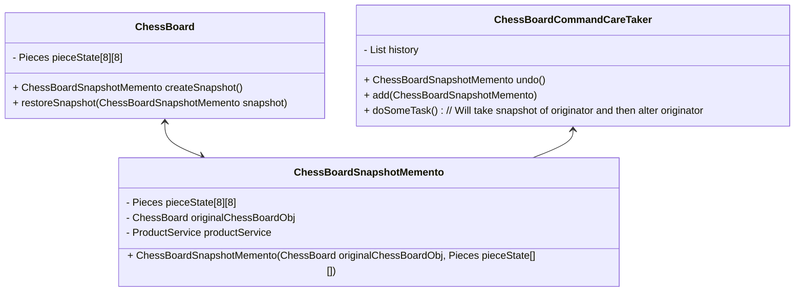
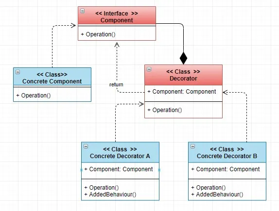
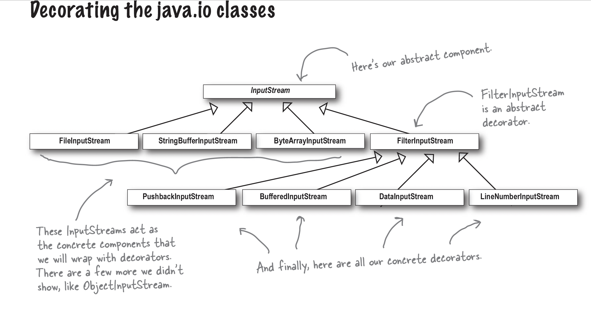
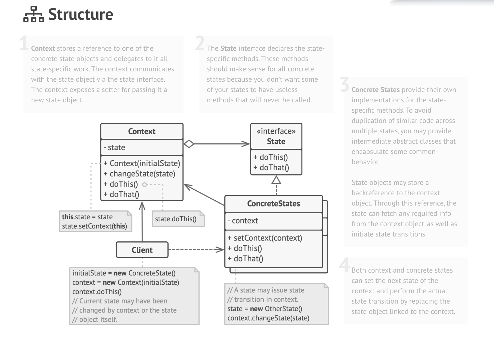

# Overview
* SOLID Principle
* Design Patterns
    * Creational Patterns
        1. [Factory](#factory-pattern) : creates and returns a new obj based on argument
        2. [Abstract Factory](#abstract-factory-pattern) : factory of factory
        3. [Builder](#builder-pattern) : Builds complex object 
        4. [Prototype](#prototype-design-pattern) : to create duplicate object
        5. [Singleton](#singleton-design-pattern) : Single object of a class.
        6. [Object Pool](#object-pool-pattern)
    * Structural Patterns : How more than one class/objects are structured
        1. [Adaptor](#adapter-design-pattern)
        2. [Bridge](#bridge-design-pattern)
        3. [Composite](#composite)
        4. [Decorator](#composite-design-pattern)
        5. [facade](#facade-design-pattern) **TODO**
        6. [Flyweight](#flyweight-design-pattern)
        7. [Proxy](#proxy-pattern)
    * Behavioral Patterns : How more than one objects communicate with each other
        1. [Chain of Responsibility](#chain-of-responsibility)
        2. [Command](#command-design-pattern) **TODO**
        3. [Iterator](#iterator-design-pattern)
        4. [Interpreter](#iterator-design-pattern)
        5. [Mediator](#mediator-design-pattern)
        6. [Memento](#memento-design-pattern)
        7. [Observer](#observer-pattern)
        8. [State](#state-design-pattern) : When system can have multiple states
        9. [Strategy](#strategy-pattern)
        10.[Template](#template-pattern)
        11.[Visitor](#visitor-design-pattern)


Credits: https://refactoring.guru/design-patterns/catalog

# SOLID Principle
https://www.freecodecamp.org/news/solid-principles-single-responsibility-principle-explained/

## Single Responsibility
- A class should have only one reason to change. 
- Class should have only 1 purpose - **Applies to class**
- Exa: class should not be doing hashing as well as save to file operation

https://en.wikipedia.org/wiki/Single-responsibility_principle

## Open close Principle
- The open-closed principle states that software entities should be open for extension, but closed for modification.  **Applies to class**
- If we have a password hasher and adding new pass hasher algo, then it should be such that adding new algo do not change existing class as well as adding new algo should be easily expandable such than min no of code needs to be written
- Feel free to **extend** our classes with any new behavior you like. If your needs or requirements change (and we know they will), just go ahead and make your own extensions.
- Sorry, we’re **closed**. That’s right, we spent a lot of time getting this code correct and bug free, so we can’t let you alter the existing code. It must remain closed to modification. If you don’t like it, you can speak to the manager.
- Our goal is to allow classes to be easily extended to incorporate new behavior without modifying existing code. What do we get if we accomplish this? Designs that are resilient to change and flexible enough to take on new functionality to meet changing requirements.
- **Decorator pattern** is an example of  this principle


## Liskov substitution principle
- **Applies on subclass - inheritance**
- Each subclass should be substitutable for its parent class. It should **only extend its functionality rather than overriding** it…
- Like Square should not be subclass of Rectangle since it does not have properties called width and height. For square both are same. So rather it should be a parallel class not inherited one.
- The Liskov substitution principle simply implies that when an instance of a class is passed/extended to another class, the inheriting class should have a use case for all the properties and behavior of the inherited class.

## Interface segregation Principle
- segregate interfaces as much as possible. **Applies to interfaces**
- It should not force the class to implement things which are not required.
- The interface segregation principle states that the interface of a program **should be split** in a way that the user/client would only have access to the necessary methods related to their needs.

## Dependency inversion principle
- **Woks for Composition**
- Components should be dependent on abstraction(Interfaces) rather than concrete classes. i.e, Class should not load concrete class and then call its method. Rather it should have variable like IHasher which is interface/abstract class and then call IHasher.hashPw() so that - IHasher can have multiple hashing algorithms and adding/ deleting algorithm do not require our class to change implementations
- One of the way to achieve this is Factory pattern
- DI is the method of implementing O in SOLID principle

# Design Patterns In Depth

## Creational Patterns
Provides **object creation** patterns.

### Factory pattern
- A factory pattern is a creational pattern. 
Put another way, a factory pattern is used to create objects of a specific type. 
A strategy pattern is use to perform an operation (or set of operations) in a particular manner
- When implementation class has code to initialize multiple concrete classes based on requirement/input its not **closed for modification**. Any new introduction of concrete class or change required this class to be re-opened.
- Helps in - Dependency inversion Principle as Both highlevel and Level objects can depend on abstractions.
- Relies on *Inheritance*. Object creation is delegated to sub classes which implement factory method to create object.

> The factory method pattern defines an interface for creating an object, but lets subclasses decide which class to instantiate. Factory methos lets a class defer instantiation to subclasses.

**To solve this problem** Factory pattern comes into the picture.

- this helps with the principle: *"Identify the aspects that vary and separate them from what stays the same"*

### Abstract Factory pattern 
- Factory of factory : One factory initializes another factory.
- For Country, Pizza: First factory gets country specific object and the country specific object then gets concrete pizzas.
- Encapsulated object creation
- provides a way to create all object at one place. Helps avoid duplication.
- Relies on: *Object composition* object creation is implemented in methods exposed in the factory methods.

> The Abstract facory pattern provides an interface for creating families of related or dependent objects **without specifying their concrest class**

```java

interface IPizza {}
class Margaritta implements IPizza {}

interface IFactory {}
class INPizzaFactory implements IFactory(){
    if pizzaType = "Margaritta" : return new Margaritta();
}
class USPizzaFactory implements IFactory(){}
class IRPizzaFactory implements IFactory(){}

class CountryPizzaFactory {
    if country == "IN" : return new INPizzaFactory(pizzaType);
    if country == "US" : return new USPizzaFactory(pizzaType);
    ....
}

class Client {
    IPizza pizza = PizzaFactory.getPizzaFor("IN", "Margaritta");
    pizza.order();
}

```

### Builder pattern
If you find yourself in a situation where you keep on adding new parameters to a constructor, resulting in code that becomes error-prone and hard to read, perhaps it's a good time to take a step back and consider refactoring your code to use a Builder.

### Prototype design pattern
In the prototype pattern, cloning is delegated to the actual objects being cloned.
Basically concrete class implements Cloneable interface and overrides clone method.
Clients need not worry when references object using interface/abstract class which actual object being copied. 

### Singleton design pattern

### Object Pool Pattern

- Used to manage reusable pool of object
- Philosophy: Pick object from pool, use, again return it to pool
- 2 Important points
    - DbConnectionPoolManager should be a Singleton Class
    - Aquiring and releasing resource should be Thread safe operation

```java
class Client {}

class DbConnectionPoolManager {
    List<DbConnection> inUseDbConnection;
    int initialPoolSize;
    int maxPoolSize;
    List<DbConnection> availableDbConnection;

    DbConnectionPoolManager(int initialPoolSize){
        for(int i=0;i<initialPoolSize; i++){
            availableDbConnection.add(new DbConnection());
        }
    }

    DbConnection getDbConnection(){
        lock.aquire();
        DbConnection dbConnection = availableDbConnection.get();
        availableDbConnection.remove(0);
        inUseDbConnection.add(dbConnection);
        lock.release();
        return dbConnection;
    }

    void releaseResource(DbConnection dbConnection){
        lock.aquire();
        availableDbConnection.add(dbConnection);
        inUseDbConnection.remove(dbConnection);
        lock.release();
    }
}

class DbConnection {
    Connection conn;

    DbConnection(){
        conn = Utility.createConnection("url:port");
    }
}
```

Advantages:
    - Reduce overhead of frequently used expensive/resource intentive object creation Like DbConnections
    - Reduce latency as objects already initialised
    - Prevent resource exhaustion
Disadvantages: 
    - Resource leakage if not handled properly
    - Additional complexity to manage pool
    - Thread safery required in pool management

## Structural Patterns
These patterns explain how to assemble objects and classes into larger structures while keeping these structures flexible and efficient.

### Adapter Design pattern

### Bridge Design Pattern

- Similar to Strategy design pattern
- Difference
    - Intent of Strategy is to change behaviour of object at run time
    - Intent of Bridge is Both abstract class's child and implementation classes can grow independently
- Definition: It lets you split a large class or set of closely related classes into 2 separate hierarchie 1) abstraction and 2) Implementation which can be developed independently
- This pattern tries to solve problem by switching from inheritance to composition
- Abtraction is generally what client application will call and which will act as a controller and Implementation classed will do the actual job



We can have M x N combinations using above method. If we were to use Inheritance we would need to create MxN classes.
Here only M+N classed are required to be created.

```java
abstract class Shape { // This is abtsraction
    Color color;
}
class Square {}
class Rectangle {}

interface class Color { doColor(); } // This is implementation
class RedColor { doColor(){} }
class BlueColor { doColor(){} }
```

References:
- [Refactoring Guru](https://refactoring.guru/design-patterns/bridge)

### Composite Design Pattern
- ** Object Inside Object **
- Like File System, Employee Hierarchy or Tree Like structure Composite pattern can be used.
- Problem: 

```java

```

### Facade Design Pattern

### Flyweight Design Pattern

### Proxy pattern:
- Useful to wrap out main method from client and put explicit sanity checks/ validations
- This is used in a daily practice.
- Concept: Request to real object will go via proxy layer
- Can be used for
    - Access validation: Before doing actual task we autorise the request
    - Caching: Proxy itself can cache and respond as per requirement
    - Proxy can be pre and post processing for logging, sending matrics, etc 
- Important points
    - In Proxy same **Interface** is shared between service class and a proxy class
- Benifits
    - Proxy uses same interface for both service class and our custom proxy class. So, even if client code is written using Interface we can replace the implementation without much changes.
    - Service class instantiation stays with proxy class
    - client will initialise proxy class and use it
- References
    - [Shreyansh Jain YT](https://www.youtube.com/watch?v=9MxHKlVc6ZM&list=PL6W8uoQQ2c61X_9e6Net0WdYZidm7zooW&index=15) 
    - [Refactor Guru](https://refactoring.guru/design-patterns/proxy)

**Class Diagram**



**Java Implementation**
```java
interface  ProductService {
    Product getproductById(String productId);
}

class ProductServiceImpl implements ProductService{
    @override
    Product getproductById(String productId) {
        // HTTP call to fetch Product from Product service
    }
}

class ProductServiceProxy implements ProductService{

    private CacheService cacheService;
    private ProductServiceImpl productServiceImpl = new ProductServiceImpl();

    @override
    Product getproductById(String productId) {
        // Can do validations to ensure proper use of sdk
        if(StringUtils.isEmpty(productId)) {
            throw Exception("Invalid productId");
        }

        // Can check chached data
        if(cacheService.isPresent(productId)) {
            return cacheService.get(productId);
        }
        return productServiceImpl.getproductById(productId);
    }
}

class Client {
    ProductService productService = new ProductServiceProxy();

    Product product = productService.getProductbyid("product_id");
}
```

## Behavioral patterns
These patterns are concerned with algorithms and the assignment of responsibilities between objects.

### Chain of Responsibility



- the chain of responsibility pattern creates a chain of receiver objects for a request.
- One such example is Http request handling by Servlet Filters
- In this design each Handler checks if it needs to process Else it will pass it to next Handler
- Here each Handler should have reference to next handler.
- This is mainly useful when requestor is unaware of which kind of Handler to use i.e, Log level Info,Errot,Critical which can be given at run time.

**Points**
- <Advantage> Decoupling between request and response processing
- <DisAdvantage> Creates nesting which may result in a ling stack trace


**References**

- https://www.geeksforgeeks.org/chain-responsibility-design-pattern/
- https://refactoring.guru/design-patterns/chain-of-responsibility

### Command Design Pattern
TODO


### Iterator Design Pattern
TODO

### Mediator Design Pattern

### Memento Design Pattern

- Useful when object state needs to be maintained to support Undo Functionality or restore at specific snapshot version. **Maintain History**
- It does not expose internal implementation
- It has 3 components
    - Originator
        - This is the original class whose state's snahshot should be taken
        - It is responsible for producing snapshot and restoring from a given Mememto class
    - Mememto:
        - Special class which stores state of orginal class
        - Should have all fields as immutable and recomemnded be created via constructor.
        - Memento is generally sub class of originator which lets originator access all states of Memento
        - Doesn't declare any public field or getter or setter methods.
    - Caretaker:
        - Maintains history of mememto
        - Caretaker dont have visibility in Memento class and cant't temper its state



### Interpreter

- Interpret expression using a Context
- It has
    - Context: 
    - Abstract expression: 
        - Terminal expression: 15
        - Non termnal expression: (15 + 26) 

```java
[TBD]
```

### Mediator Pattern

- Different objects communicate through **Mediator** allowing loose coupling

```java
interface Colleague {
    void placeBid(int bidAmount);
    int receiveBidNotification();
    String getName();
}

class Bidder implements Colleague {
    String name;
    AuctionMediator mediator;

    Bidder(){
        mediator.add(this);
    }

    placeBid(int amount){
        mediator.placeBid(this, amount);
    }

    ...
}

interface AuctionMediator {
    void addBidder(Colleague bidder);
    void placeBid(Colleague bidder, int amount);
}

class Auction implements AuctionMediator {
    List<Colleague> colleagues;

    Auction(){
        colleagues = new ArrayList<>();
    }

    addBidder(Colleague bidder){
        colleagues.add(bidder);
    }

    void placeBid(Colleague bidder, int amount){
        for(Collegue clg : colleagues){
            if(!clg.getName.equals(bidder.getName())) {
                clg.receiveNotification(amount);
            }
        }
    }
}

```

### Strategy Pattern
Deciding behavior class based on strategy.
A strategy pattern is an **behavoral pattern**.
Definition as per Head First
> The Strategy Pattern defines a family of algorithms, encapsulates each one, and makes them interchangeable. Strategy lets the algorithm vary independetly from clients tha use it.

Examples:
Lets say client application need to perform cloud upload operations.\
The upload can be done via Azure, AWS, Google or any Data storage service based on requirement. \
In this case a different upload is considered as **Upload Strategy** which should be abstracted out from client.

In the below example client class need not worry about addition of new strategy or change in any of the strategy of File Upload.

```java
/* Client class */
class ProcessData {
 IFileupload fileUpload; // Coding to an abstraction rather than implementation

 void process(FileUploadRequest request, FileUploadServices fileUploadService){
    fileUpload = FileUploadStrategies.get(fileUploadService).upload();
 }
}

enum FileUploadService { AWS, AZURE, GOOGLE}

class IFileupload { void upload(FileUploadRequest request); }
class AzureFileUpload implements IFileupload{
    void upload(FileUploadRequest request);
}
class AWSFileUpload implements IFileupload{
    void upload(FileUploadRequest request);
}
class GoogleCloudFileUpload implements IFileupload{
    void upload(FileUploadRequest request);
}

/**
 * This class returns strategy based on request
 * **/
class FileUploadStrategies {
    void get(FileUploadService service){
        switch(service) {
            case AWS:
                return new AWSFileUpload();
                break;
            case AZURE:
                return new AzureFileUpload();
                break;
            case GOOGLE:
                return new GoogleCloudFileUpload();
                break;        
        }
    }
}

```

### Template pattern

When to use ?
- This is behaviral pattern
- When we need our classed to 
    - **follow specific steps (template) but also**
    - give flexibility to customise the behaviour

```java
abstract class PaymentTemplateClass {
    abstract void validateReq(Payment payment);
    abstract void debit(Payment payment);
    abstract void credit(Payment);

    /*
    This is a template for payment workfloe execution but there are abstract method being used
    This class acts as a template and 
        Child classed need to fill-in remaminng part as per their customised behaviour.
    */
    public final void doTransaction(Payment payment){
        if(validateReq(payment)) {
            debit(payment);
            credit(payment);
        } else {
            // Inform not possible by throwing exception
        }
    }
}

class Cashpayment extends PaymentTemplateClass{
    void validateReq(Payment payment){ // do something }
    void debit(Payment payment){ // do something }
    void credit(Payment){ // do something }
}
```

### Visitor Design pattern

### Observer Pattern
One data source object notifies all observers regarding data change. Observers can be added and removed at any time.
This is one of the most heavily used pattern in JDK. \
This pattern a very good example of loosely coupled objects.

In this pattern there are 2 types of object
1. Notifier/Publisher: A class which notifies of any state change to all subscribers
2. Subscribers: Which listens to the notifier and processed the data to do its relevant processing.

Here additional functionalities added to support behaviour is
1. Subscriber can subscriber to specific type of event
2. Subscriber can unsubscribe
3. Notifier can notify of any event change.

One good example is UI components. We can add observers for button click and button can notify interested subscribers.

Definition
> The Observer Pattern defines a 1:Many dependency between objects so that when one object changes state, all of its dependents are notified and updates automatically

```java
interface Observer { void stateChanged(Object event); }
interface Notifier { 
    void notify(); 
    void registerObserver(Observer observer); 
    void removeObserver(Observer observer);
}

class FileChangedNotifier implements Notifier {

    List<Observer> observers = new Observers();

    fileChangedListener.onFileChanged(()->{
        notify();
    });

    void notify(){
        for(Observer observer: observers){
            observer.stateChanged(someRelevantObject);
        }
    }

    void registerObserver(Observer observer) {
        observers.add(observer);
    }

    void removeObserver(Observer observer){
        observers.remove(observer);
    }

}

class IAmObserver implements Observer {

    @override
    void stateChanged(Object event){
        // handling for the state changed notification goes here
    }
}

class HelperClass {
    Notifier notifier = new FileChangedNotifier();
    Observer observer = new IAmObserver();

    // Registering observer
    notifier.registerObserver(observer);

    notifier.fileChanged();

    // Removing observer
    notifier.removeObserver(observer);
}

```

### Decorator Pattern
- Attaches additional responsibility to object at run time.
- Allows us to add some behaviour at run time without re-compiling.
- Follows Open-close principle
- the decorator is a wrapper around concrete components or another decorator.

> The Decorator Pattern attaches additional responsibilities to an object dynamically. **Decorators provide a flexible alternative to subclassing for extending functionality.**



Credits: https://medium.com/maestral-solutions/the-decorator-detailed-look-at-design-pattern-e7bfec64663b

When to use: some set of concrete classes can use a combination of additional features or functionality which can be added at run time.
It **wraps concrete class** and becomes wrapper to it by adding its own functionality like.\
The decorator adds its own behavior either before and/or after delegating to the object it decorates to do rest of the work.
In other words it extends class to be decorated (wrap), override its behaviour with additional of child class's behaviour.

Cons: Adds lot more small sub classes

Example:
```java
Pizza pizza = new CheeseToppings(new Margarita())

// Real world Example from Java
FileInputStream fStream = new FileInputStream(); // txt file
fStream = new BufferedInputStream(fStream);      // concret Decorator. Addition of functionality: line read
fStream = new LineNumberInputStream(fStream);   // concrete decorator. Addition of functionality: line no count
```

Lets first go with famous example of pizzas.\
There is this pizza which can have N number of toppings as per customer's requirement.\
Toppings - A,B,C,D,E\
Imagine what would happen if we try to crerate all possible combinations by ourselves like
1. A + B
2. A + C + E
3. C + D
4. B
5. etc etc

Total there can be 2^5 possible combinations i.e, 32. Making 32 classes is insane.

**This is the problem Decorator pattern is trying to solve.**

1) There will be one standard Interface and class for Pizzas
2) There will be one standard Decorator interface and its various implmenentations of toppings

```java
// Main objects
interface IPizza {}
class MaargaritaPizza implements IPizza {}

// added functionalities on top of above base objects.
interface IToppingsDecorator {}
class ToppingsA implements IToppingsDecorator {
    IPizza pizza; // This holds reference of base objects i.e, pizza
}
class ToppingsB implements IToppingsDecorator {
    IPizza pizza; // This holds reference of base objects i.e, pizza
}
class ToppingsC implements IToppingsDecorator {
    IPizza pizza; // This holds reference of base objects i.e, pizza
}

// Now Lets say user says Margarita pizza with toppings A and C
// Pseudo code

IPizza pizza = getBasePizza(userInputForPizza); // returns new MaargaritaPizza()

// now add toppings...
for(Topping topping: toppingsList){
    pizza = addNewTopping(pizza, topping)
}

void addNewTopping(IPizza pizza, Topping topping){
    switch(topping){
        case A:
            pizza = new ToppingsA(pizza);
            break;
        case B:
            pizza = new ToppingsB(pizza);
            break;
        case C:
            pizza = new ToppingsC(pizza);
            break;
    }
    return pizza
}

```



## State Design Pattern
- Can use this when your system have multiple states and multiple events on same state
- Can create interface of State with possible functionalities/event at each state
Avoids multiple if-else conditions
- State Interface will note down all possible operations
- Concerete State classes Like State1, State2 will implement State Intrface and implement Only relevant Operations like Op1, Op2 and for non relevant operation either throw exception or do default implementation.



Examples: 
    - Vending Machine
    - ATM 

References
    - https://refactoring.guru/design-patterns/state

# Important LLD concepts

## Coupling
The knowledge or dependency each class has about other classes. This should be minimum. 

## Cohesion
Degree of similarities
Cohesion refers to the level of a component which performs a single well-defined task
The java.io package is a highly cohesive package because it has I/O related classes and interface. However, the java.util package is a weakly cohesive package because it has unrelated classes and interfaces.

## Association
Association represents the relationship between the objects.
1:1
1:many
many:1
many:many

## Aggregation
Aggregation is a way to achieve Association. Aggregation represents the relationship where one object contains other objects as a part of its state. 
It represents the weak relationship between objects.
It is also termed as a has-a relationship in Java. 
Like, inheritance represents the is-a relationship. It is another way to reuse objects.

## Composition
Way to achieve association
Strong relationship between objects
Child object can not exist without a parent object.
Has-a relationship. Board has pieces
Inheritance
Is-a relationship
Engineer is-a employee.

Object based programming language
Object-based programming language follows all the features of OOPs except Inheritance. JavaScript and VBScript are examples of object-based programming languages.
When the type of the object is determined at compile time(by the compiler), it is known as static binding.
When the type of the object is determined at run-time, it is known as dynamic binding.
Think about concurrency in LLD interview

# Notes
1. In LLD Interview…
    - First identity entities… like players, board, snack, ladder
    - Separate out Models ← data and Services ← logical part
    - Don't directly jump to code.
    - Think about the behaviors of entities
    - Checking our common behaviors and specific behaviors also helps identifying Interfaces and inheritance
    - See Inheritance vs Composition
2. Identify the aspects of your application which varies and separate them from what stays the same
    - Take the part that varies and encapsulate them so that later that part can be changed independently.
3. Program to an interface, not an implementation
    - It doesn't mean to use java Interface only but rather use supertype of the behavioral classes usually abstract class or Interface
        ```java
            class NonPreferredImplmentation {
               SHAHashAlgorithm shaHashAlgo;
            }

            class RecommendedImplementation {
                IHashAlgorithm hashAlgorithm;
            }

            class SHAHashAlgorithm implementa IHashAlgorithm {}
        ```
4. Favor composition over inheritance.
    - Has-A can be better than Is-A
    - One of the problem with Inheritance is that class needs to be inherited. Which is not possible in all the cases.
5. Strive for loosely coupled designs between objects that interact.
    - Observer is such pattern

# LLD Interview Tips

[Refer this page](./LLD%20Interview.md)

# References
- LLD primer: https://github.com/prasadgujar/low-level-design-primer/blob/master/solutions.md
- Command Design Pattern : https://medium.com/@learncsdesign/learn-the-command-design-pattern-60cad5b85e34
- https://www.tutorialspoint.com/design_pattern/
- https://refactoring.guru/design-patterns/catalog