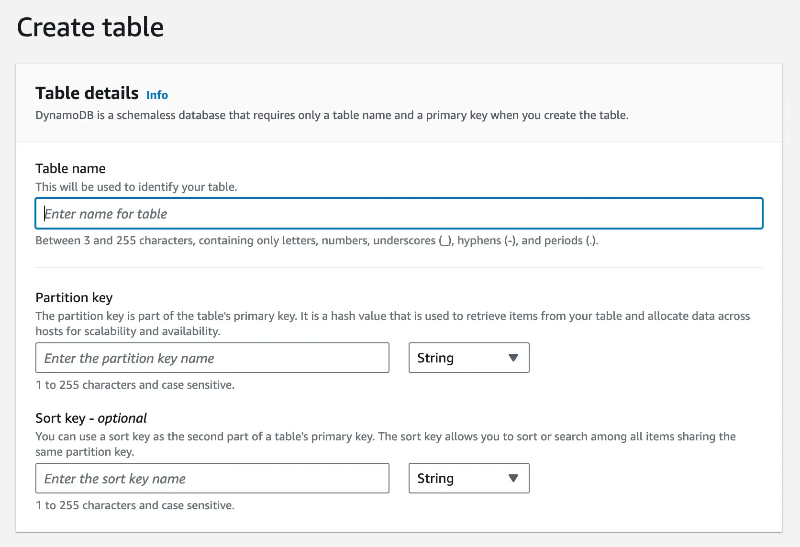

# Dynamo DB

## Characteristics
- Fully manages by AWS data store
- Highly scalable
- NoSQL database
- Now supports transactions as well :) 
- Not Open source DB

## How to use it 

It has
- Tables
    - Like relational tables
    - It has mandatory primary key 
    - Allows to create a Secondary Index to query on non primary fields
- Item
    - Like row in relational DB
    - contain upto 400 KB of data including all its attributes
- Attributes
    - Key value pairs which makes an Item

### Important Considerations
- $Primary Key={Partition key}:{SortKey: Optional}$
- **Partition Key**: Defines how data will be partitioned in actual physical machines.
- **Sort Key(Optional)**: Based on query pattern this can be usedul for range queries as well Sorted output.
- Example
    - For chat application it makes sense to have 
        - partition key: group_id
        - sort key: timestamp
        - Primary Key will be: {group_id}:{timestamp}
    - So, all the data for same group_id is stored together sorted by timestamp
- **Consistent Hashing** is used for partitionning data evently across machines
- Withing each partition data is stored in **B Tree** which is self balancing tree stored in disk. Indexed on sortKey
- Secondary Indexes
    - Global Secondary Index:
        - When Index is different from main partition Key. Lets say on user_id than chat_id
        - Optional Sort key can also be defines.
        - Use case: Find user messages sorted by timestamp, Use GSI for global search across all partitions, such as searching by email in a user database
        - Max suppoted count: 20 GSI per table
        - Implementation: 
            - GSI is itself a separate table with its own partition schema
            - When item updated -> GSI get updated in async way
            - GSI uses same consistent hashing mechanism but with diff partition and SortKey
    - Local Secondary Index:
        - Here partition key remains same but sort order changes.
        - Required data is present under same partition only but B tree sort key needs to be changed.
        - use case: Query all messages by specific user within a group chat, Use LSI for local search within partitions, such as finding recent orders within a customer partition
        - Max supported count: 5 LSI per table
        - Implementation
            - Maintain separate B tree with index as LSI's sort key
            - Synchronous updates to LSI > Strongly consistent

## Query
- There is not direct SQL style structure. Need to use SDK or AWS console to query data
- In Dynamo DB entire item is being read. Which can lead to network bandwidth higher utilisation. So its important to denormalise data effectively.

## CAP theorem

- DynamoDB can be configured to have Strong consistency OR eventual consistenty
- Eventual Consistency : Default. AP System with BASE availability
    - Lower latency
    - Higher availablility
- Strong Consistency: all reads reflect the most recent write
    - Higher latency
    - potential lower availability
    - CP System with ACID properties

## Other Distributed things to consider

- Replication
    - Data gets replicated to atleast 3 nodes
    - Replication in same Region and diff AZs
- Eventual Consistency
    - Write operation success: Majority of replica acks
    - Stale reads by other replicas
- String consistency
    - Reads are routed to Leader node (Little doubtful here)
- Quorum
    -  Read and write is made by following Quorum approach.
    - Write to atlease W nodes
    - Read to alreast R nodes to ensure data cosnistency
- Confict
    - "last writer wins" approach based on timestamp
- Transaction
    - 2 Phase commit protocol

## CDC: Change data capture
- DynamoDB provides CDC streams in real time 
- use cases
    - Maintain elastic search upto date to provide additional search capabilities over DynamoDB data
    - Real time analytics
    - Notification based on data change

## When not to use Dynamo DB

- Cost Efficiency: If too much read/write load -> Cost is cconsiderable factor
- Complex queries
- Data modeling constraints: If frequently using GSI and LSI then Postgres might be a better choice
- Vendor lock-in: Constraint to use AWS. if we need to be vendor neutral then not a good choice.

# References
1. [Hello Interview: DynamoDB deep dive](https://www.hellointerview.com/learn/system-design/deep-dives/dynamodb)