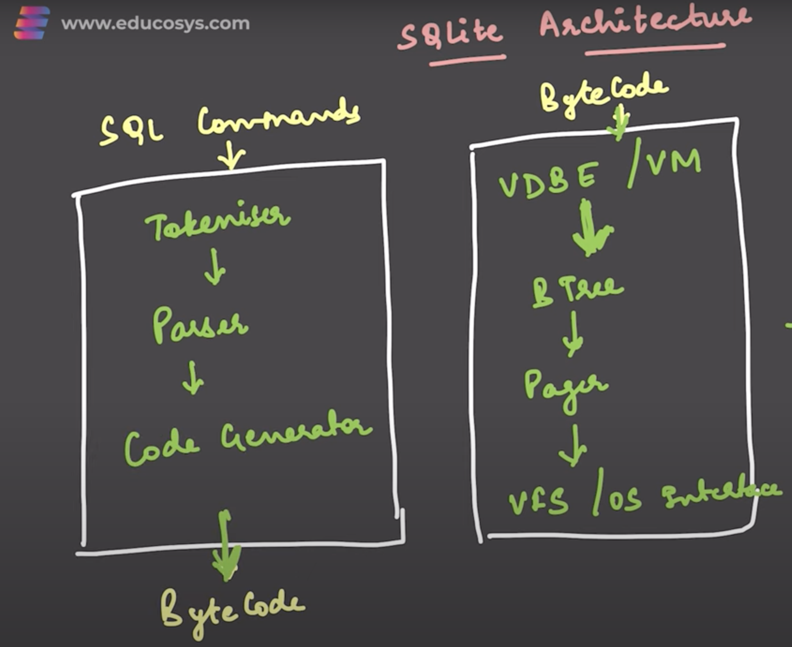

# SQLite

## What is SQLite ?
- It is lightweight, embedded, **serverless** DB.
- Embedded: SQLite library runs in the same process as main application. No need to run separate process for it.
- Zero configuration needed.
- supports **ACID** properties
- Thread safe
- Cross platform. Same DB file runs seamlessly on any Win/Linus/Mac machine
- Most simplest DB

# Internals
- It has single file for each database

## Tokenizer
Recognise each keyword passed in sql query

## Parser
Evaluate if set of tokens is making sense and follows valid sequence ?. If makes sense what is the next step...

## Byte code generator

# References:
- [Credits: Educosys YT Video](https://www.youtube.com/watch?v=IrzF4r9hqlY&t=168s)