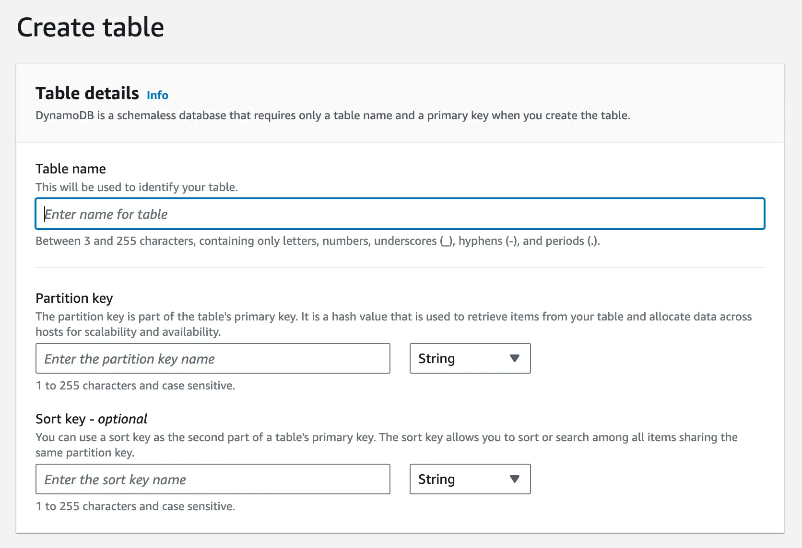

# Dynamo DB

## Characteristics
- Fully manages by AWS data store
- Highly scalable
- Unlimited table size
- NoSQL database - No Schema
- Now supports transactions as well :) 
- Not Open source DB
- Goal: Consistent performance at any scale with single digit ms latency
- Multi paxos format. One paxos for each partition

## Usage
- So many Amazon internal services use DynamoDB 
- External customers as well use DynamoDB
- Peak Load during Prime Day sale at Amazon - 89.2 million RPS ~ 9*10^7 rps with Single digit mS latency i.e, <= 9 mS latency

## How to use it 

It has
- Tables
    - Like relational tables
    - It has mandatory primary key 
    - Allows to create a Secondary Index to query on non primary fields
- Item
    - Like row in relational DB
    - contain upto 400 KB of data including all its attributes
- Attributes
    - Key value pairs which makes an Item

### Important Considerations
- $Primary Key={Partition key}:{SortKey: Optional}$
- **Partition Key**: Defines how data will be partitioned in actual physical machines.
- **Sort Key(Optional)**: Based on query pattern this can be usedul for range queries as well Sorted output.
- Example
    - For chat application it makes sense to have 
        - partition key: group_id
        - sort key: timestamp
        - Primary Key will be: {group_id}:{timestamp}
    - So, all the data for same group_id is stored together sorted by timestamp
- **Consistent Hashing** is used for partitionning data evently across machines
- Withing each partition data is stored in **B Tree** which is self balancing tree stored in disk. Indexed on sortKey
- Secondary Indexes
    - Global Secondary Index:
        - When Index is different from main partition Key. Lets say on user_id than chat_id
        - Optional Sort key can also be defines.
        - Use case: Find user messages sorted by timestamp, Use GSI for global search across all partitions, such as searching by email in a user database
        - Max suppoted count: 20 GSI per table
        - Implementation: 
            - GSI is itself a separate table with its own partition schema
            - When item updated -> GSI get updated in async way
            - GSI uses same consistent hashing mechanism but with diff partition and SortKey
    - Local Secondary Index:
        - Here partition key remains same but sort order changes.
        - Required data is present under same partition only but B tree sort key needs to be changed.
        - use case: Query all messages by specific user within a group chat, Use LSI for local search within partitions, such as finding recent orders within a customer partition
        - Max supported count: 5 LSI per table
        - Implementation
            - Maintain separate B tree with index as LSI's sort key
            - Synchronous updates to LSI > Strongly consistent

## Query
- There is not direct SQL style structure. Need to use SDK or AWS console to query data
- In Dynamo DB entire item is being read. Which can lead to network bandwidth higher utilisation. So its important to denormalise data effectively.

## CAP theorem

- DynamoDB can be configured to have Strong consistency OR eventual consistenty
- Eventual Consistency : Default. AP System with BASE availability
    - Lower latency
    - Higher availablility
- Strong Consistency: all reads reflect the most recent write
    - Higher latency
    - potential lower availability
    - CP System with ACID properties

## Data Partitioning
- Table is partitioned into subset of data with **contiguous key range**
- Partition is replicated across AZs under same Region
- One of the will be leader, others will be follower
- If leader goes down for partition, re-election happens and one of the replica will act as a leader partition
- Strong consistent data -> Read from Leader partition
- Eventual consistent data -> Can be read from replica node
- If load on one partition increases, it can be splitted in multiple partitions further
- DynamoDB proactively balances partitions across the nodes based on throuput
- Partition contains = [ B Tree + WAL ]
- Storage Replica contains -> B Tree + WAL
- Log replica only has WAL

## Read Write Queries

- When write request comes
    - It will be accepted by leader partition node
    - It will add entry in WAL - Write ahead Log
    - Send update to its replicas. Replica writes in WAL and responds back
    - Once majority of replicas responds i.e, Quoram is achieved leader acks success response to client

## Durability
- For durability WAL are periodically pushed to S3
- DynamoDB uses checksum to validate data correctness and its not getting altered via n/w transfer

## Services in DynamoDB
- MetaData Service
    - Keeps information regarding partitions data
    - Router talks to meta data service and forwards request to approprere Storage node
    - Maintains data of all partitions, key range of each partition, storage node of each partition
- Router
    - Cache routing meta data to avoid network call to meta data server for each request
    - To avoid sudden traffic burst in case all router service reboots Router do not directly query MetaData service but queries to MemDS ( Distributed in-memory data structure) efficient for range query
        - MemDS is implemented using Patricia + Merkle Tree
        - Router serves most of the requests from in-memory data for routing but still it calls MemDS in-order to make it **ready for the incoming traffic** whenever router service restarts and all loads needs to be served by MemDS (Be ready for the actual traffic)
- Auto Admin service
    - Takes care of health check, partition health, table scaling, create table/index etc
- Storage Admission Control
    - Ensures Storage nodes are not overloaded and requests are rate limited properly
    - User defines Write and Read capacity Units. There will be rps limit at server level as well as at partition/table level for max supported rps
    - DynamoDB has RCU and WCU (Write capacity Unit) and is divided equally across partitions.
    - Storage node has capacity at Global level and at partition level
        - i.e, Server node capacity = 300, P1 = P2 = P2 = 100 request capacity
        - What if some partitions are underutilised and some partition gets more requests than allowed ?
        - DynamoDB promovisions some additional burst capacity lets say 10% extra requests
        - Server node will have one token bucket and each partition will have allocated token bucket(100 req/s) + burst bucket(10 req/sec). If for any partition allocated bucket is full but having burst bucket and global bucket still available then request can be served
        - Adaptive capacity: (Way of handling throuput dilution)
            - Partition capacity under same Storage node would be proportionate to ite incoming requests / table level capacity
- Global Admission Control
    - Global table level capacity bucket which router checks with
- Transaction Management
- Lock Management
- Backup & Restore
- Auth and Authz Service
- Storage nodes

## Grey network failure
- What happens when replicas are not able to connect to leader node and assumes leader is dead.
- Should it initiate leader election ? If it does then it will create split brain problem
- Before starting leader election replica checks with other replicas as well to see if leader is alive or not 

## Dependent services
- AWS IAM: Authentication
- AWS KMS: Key Management System

## Other Distributed things to consider
- Replication
    - Data gets replicated to atleast 3 nodes
    - Replication in same Region and diff AZs
- Eventual Consistency
    - Write operation success: Majority of replica acks
    - Stale reads by other replicas
- String consistency
    - Reads are routed to Leader node (Little doubtful here)
- Quorum
    -  Read and write is made by following Quorum approach.
    - Write to atlease W nodes
    - Read to alreast R nodes to ensure data cosnistency
- Confict
    - "last writer wins" approach based on timestamp
- Transaction
    - 2 Phase commit protocol

## CDC: Change data capture
- DynamoDB provides CDC streams in real time 
- use cases
    - Maintain elastic search upto date to provide additional search capabilities over DynamoDB data
    - Real time analytics
    - Notification based on data change

## When not to use Dynamo DB

- Cost Efficiency: If too much read/write load -> Cost is cconsiderable factor
- Complex queries
- Data modeling constraints: If frequently using GSI and LSI then Postgres might be a better choice
- Vendor lock-in: Constraint to use AWS. if we need to be vendor neutral then not a good choice.

# References
1. [Hello Interview: DynamoDB deep dive](https://www.hellointerview.com/learn/system-design/deep-dives/dynamodb)
2. [Amazon DynamoDB - Paper Explained by Arpit Bhayani](https://www.youtube.com/watch?v=LnqKfLcszEg)