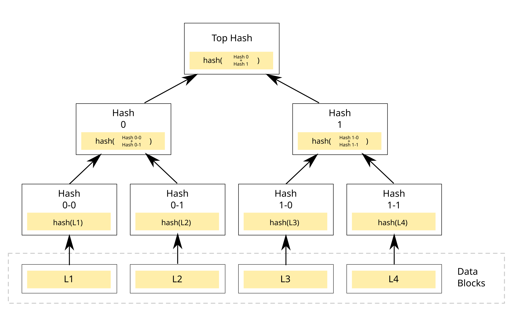

# Databases

## 3 Types of Data Models
| Relational Model                                                                   | Document Model                                                                             | Graph Model                                                          |
|------------------------------------------------------------------------------------|--------------------------------------------------------------------------------------------|----------------------------------------------------------------------|
| Considerable support for Many:Many relationships                                   | Not ideal for Many:Many relationships                                                      | Ideal for Considerable support for Many:Many relationships           |
| For 1:Many relationship this can be overhead if for each query joins are required. | Idea for 1:Many relation if while document is required for each query                      | Not ideal for 1:Many relationship                                    |
| Generally used for business data processing / transactional processing             | Generally used for dynamic and expressive data models. Schema can be evolved over the time | Very flexible if different kinf of relationshios keeps getting added |

## SQL and NoSQL
| Parameter            | SQL                                                                                           | NoSQL                                                                                                           |
|----------------------|-----------------------------------------------------------------------------------------------|-----------------------------------------------------------------------------------------------------------------|
| Schema Flexibility   | Schema is predefined. Schema update requires manual table update                              | Great schema flexibility. No need to define schema. Schema update is easy.                                      |
| Scalability          | Scalability not easy as NoSQL varients                                                        | In built scalability support                                                                                    |
| Fault tolerance      | Mostly follows Master slave architecture. If master fails slave becomes master.               | All nodes are equal. Might have leader.Data replicated amongs other nodes as well.                              |
| Transactions support | In-built ACID support. Preferred choice for financial data and where concurrency is criticall | No In-built transactions support.                                                                               |
| Consistency          | Highly consistent                                                                             | Consistency is configured as per Quorum. Mostly eventual consistent                                             |
| Data Model           | Not an ideal choice where single Data model needs multiple queries or Joins                   | Ideal choice where complete document is needed for any query as whole document is stores as a continuous block. |
| Join Support         | Most of the implementation will have Join support                                             | Not much Join support                                                                                           |

## Types
1. CPU bound database: Where all indexes are fit in RAM and only limitation will be CPU
2. I/O bound database: Where indexes does not fit in RAM and goes to disk to acoomodate others. I/O is bottleneck here.

## ACID

### Availability

### Consistency
Represents if data is up to date in DB. i.e, If read is reflecting latest write in DB ?

- Linearizable consistency: Any read will give most uptodate data
    - Can have Low latency
    - Might not be highly available
- Evantual consistency: Read can have upto date data after some delay
- Casual consistency: 
    - If read related to earlier write then it should be executed in order.
    - It fails when performing aggregation operations..

### Integrity

### Durability

## Sharding and Partitioning
> Shard the database, partition the data.

Example: 
Database has P1, P2, P3, P4, P5 partitions. while...it has
Shard S1, S3.

So data can be like these...
1. S1: P1 + P2
2. S2: P3 + P4 + P 4

when request comes, it first decide partition and then decide in which shard this partition exists.

### Sharding
- Method of distributing data across **multiple servers**
- They are physical server
- Cons: Cross shard queries are expensive

### Partitioning
- Splitting data within same instance
- Data is considered to be partitioned.

:: Two categories:
[Vertical partitioning vs horizontal partitioning](https://blog.bytebytego.com/p/vertical-partitioning-vs-horizontal)

1) Horizontal Partitioning  : Rows are splitted
2) Vertical Partitioning    : columns are splitted

## Indexes
- Indexes are generally stored in-memory. Secondary indexes generally have reference to primary index. So its necessary to carefully select your index depending on the DB selected.

## Scaling
Increasing resources in order to accomodate higher read/write traffic on DB.

### Vertical scaling
- Increase single machine resources i.e, RAM, Disk, CPU
- It has physical limit on hardware. It cant scale after certain amount. 

### Horizontal scaling
- Add more machines to increase resources for DB.
- All machines work together as cluster to server requests.

## Master slave architectire
Master serves write requests and critical read requests while there are other read replicas which is only useful for 

# Transaction Isolation Levels

Transaction: When sequence of queries are grouped as one.

Isolation: How 2 parallel transaction can affect each other. 2 Transactions are isolated if queries in one transaction do not affect queries in other transaction.

### Read Uncommitted
- With this isolation level read queries may get dirty reads as well.
- Its fast
- Also problem when transaction is rolled back. In this case dirty read was never committed to DB

### Read committed
- It ensures only commited data is being returned to any read query 
- In this case uncommitted data for any transaction can have their own copy of uncommitted changes
- Sub sequent reads may get different values if there was a write on the same key by any other query or transaction. This may create problem is decision making is based in READ value of that key.

### Repeatable reads
- It behaves as if it has taken snapshot of data before transaction
- Once the COMMIT is performed all data is being committed to DB
- At this isolation level, we ensure that when a query reads a row, that row will remain unchanged for the entire transaction.
- This is known as **Snapshot Isolation** since a transaction is isolated from another by taking different data snapshots.
- If two transactions concurrently change the same key to different values, we must **roll back one transaction.**. This is called **Optimistic Concurrency Control** since we are optimistic about our changes until they are proven incompatible. 

### Serializable Isolation
- All transactions are executed in serialized or such that no 2 transactions affect each other
- This avoids Phantom reads. Phantom reads mean - when one read in transaction gets reasult X and same read query in transaction gets result Y. Here X != Y so some phantom/ghost value is added/removed.
- Highest level of Isolation

## Data Storage & Retrievals (DDIA Notes)

## PostgreSQL vs MySQL (TODO)

## Databases

1) MySQL
- #SQL #ACID 

2) PostgreSQL
- #SQL #ACID

3) MongoDB
- #NoSQL #ACID

4) Cassandra
- #NoSQL #ACID
- written in Java
- JVM pauses execution while garbage collection

5) ScyllaDB
- #NoSQL #ACID
- Cassandra compatible DB written in C++

# Merkle Tree
- Its a binary tree of hashes.
- Each intermediate node contains hash of 2 child hash and leaf node contains hash of specific data partition range.
- Use: To compare the replication or data difference between 2 nodes's data
- Comparing hash is easier to locate which part is not synced rather than matching compelte data which can be a costly task
- Advantages: Recues data transfer to check for synchronization
- Disadvantages: need to recalculate merkle tree when any new node joins or leaves and partition re-distribution happens

# Gossip Protocol
- Helps when in a system there is no central node to keep track of system health
- Hepls all nodes to be aware about all other nodes regarding system state and if any node is down
    - Like which nodes are available
    - Key range for each partition and node assigned
- Its a Peer to Peer communication protocol
- Every second each node sends information to one random node about node itself and information it has of other nodes
- This way eventually node state will be informed to everyone
- Some times this can result in Logical Partitioning. i.e, Some nodes are yet not aware of Ring state. To handle this certain seed nodes are configured. Every node can talk to seed node to reconsile ring state
- 

# Notes

- **Partital Indexes** : [YT: Partitial Index](https://www.youtube.com/watch?v=CA2_0ZhVW2g)
    - If we have millions of rows and we want to get data for specific constraints like count >= 100 then we can create index based on this criteria
    - This will not index all DB rows but partial rows meeting criteria for count > 100
    - This is called partitial indexing and is supported in PostgreSQL
    - It increased query performanc drastically if there is very less data meeting contraint 1 to 10% data

# Database Internal Notes ([Educosys Playlist](https://www.youtube.com/watch?v=8ogJlOIxKVE))

## Components in a Database

- FrontEnd components : Interacts with client Requests
    - Tokeniser: Breaks down query in tokens
    - Parser: Analyse the query syntactically and check grammer rules
    - Optimiser: Determines the most efficient execution plan. Like which index to use.
- Backend Components : Backbone of DB
    - Execution Engine
        - Query Executor: Works on the query execution plan prepared by optimiser
        - Cache manager: Cache required DB data like frequently accessed to improve DB performance
        - utility services: Can manage Auth, backup, etc
    - Transaction manager: For Txn management support
        - Lock Manager: Manages locks for concurrent query execution and can be used in transactions. **Concurrency Control**
        - Recovery Manager: Ensures data **durability**
    - Concurrency Manager
    - For distributed DB support
        - Shard manager : Responsible for managing sharded DB nodes
        - Cluster manager: Manages cluster
        - Replication Manager: Copy data across servers to maintain **High availability, Data Redundancy, Disaster Recovery**
    - Storage Engine
        - Disk storage manager: Manage physical storage of data on Disk
        - Buffer manager: Loads block of disk data in-memory for processing / update
        - Index manager: Manages index on DB columns to ensure fast data retrieval
    - OS Interaction Layer: Interacts with diff OS system for file operations

## B Tree and B+ Tree in DBMS

#### How data is read and write to Hard Disk
- Hard disk has circular area called **Tracks** and pie shaped section called **Sectors**. 
- Intersection of track and sector is called as **File Blocks** which is usually 4 KB of space.
- Reading any data from this block requires loading entire block in RAM. 

### B Tree
- Main Idea: For CRUD Operations -> Reduce I/O Operations as I/O Operations are expensive
- Problem with Binary Tree:
    - For any read operation whole disk file block needs to be loaded in RAM which is 1 I/O operation
    - Binary tree maintains only 2 child node references. So, There is higher io cost involved for eliminating hald of the DB records.
    - If we could have get more information from loadef File block which will further reduce our search Space --> That is what we want.
- So, B Tree is like M-Way tree which maintains data for M child nodes. Each B Tree node can have ~4KB(approximated) of data stored with it. So once loaded in RAM comparision can be done to lcoate the next IO block.
- Characteristics
    - This way $log_m(No. of Records)$ IO operations will be required.
    - Optimal no. of keys to be stored in 1 tree node:-> No. of records which can be stored in one disk file block
    - Order m Binary Tree: Max no of childs a node can have will be **m** and max. no of keys will be **m-1**
    - Min no of keys a node except root should be $ceil(m/2)$
    - All the leafs are at the same level
    - Insertion:
        - If node is filled with all keys then new node will be inserted above existing nodes.
        - This way no. of multi level indexes increased as no. of record in DB increases.

### B Tree vs B+ Tree

| B Tree | B+ Tree|
|--|--|
| No linkage between leaf nodes | All Leaf node blocks are connected like linked list |
| Can store data in intermediate nodes | Stores data only in lead nodes |
| Not better than B+ tree in range query | Better in performing range queries because of leaf node linkage | 

