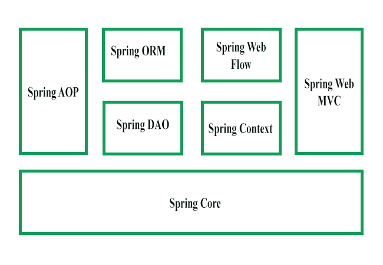

# Spring Boot

## References
1. https://www.geeksforgeeks.org/spring/
2. 

## Definitions

Spring is a lightweight and popular open-source Java-based framework developed by Rod Johnson in 2003. It is used to develop enterprise-level applications. It provides support to many other frameworks such as Hibernate, Tapestry, EJB, JSF, Struts, etc, so it is also called a framework of frameworks. 

This framework uses various new techniques such as Aspect-Oriented Programming (AOP), Plain Old Java Object (POJO), and dependency injection (DI), to develop enterprise applications. 

Features of Spring
- IoC Container
- Data access framework
- Spring MVC framework
- Transaction Management
- Spring web service
- JDBC abstraction layer
- Spring TestContext framework

Spring consists of...
### Spring Components
#### Spring Core

**It provides the IoC container.**
There are two types of implementations of the Spring container..
- bean factory : container for beans. Implements BeanFactory interface and there are many impmentations of it like XmlBeanFactory 
- application context

#### Spring AOP
Spring AOP modules allows to implements concerns/aspects in Spring application.

#### Spring Web MVC
Web MVC Implementation

#### Spring DAO

#### Spring ORM Modules
Used for accessing data from DB. 

#### Spring Application context
ApplicationContext interface of BeanFactory

#### Spring Web flow. 

### What is Bean in spring ?
In Spring, a "bean" is an object that is instantiated, assembled, and managed by the Spring IoC (Inversion of Control) container. A bean is essentially an instance of a class that is stored in the Spring application context, and it can be accessed by other parts of the application through dependency injection.

A Spring bean can be defined in a variety of ways, including:

1. Using XML configuration: Beans can be defined in an XML file and then loaded into the Spring application context.
2. Using Java configuration: Beans can be defined in a Java class annotated with @Configuration.
3. Using component scanning: Beans can be automatically detected and registered by the Spring container using annotations like @Component, @Service, @Controller, etc.

## Annotations

### @Service
In Spring, the @Service annotation is used to indicate that a particular class is a **service component** in the application. A service component is a class that performs some specific business logic, such as retrieving data from a database, performing calculations, or calling external APIs.

**When a class is marked with the @Service annotation, Spring will automatically detect it and create an instance of it as a bean in the application context.** This allows other parts of the application to easily access and use the service component through **dependency injection**.

The @Service annotation is one of several annotations in the Spring framework that are used to manage components in a Spring application. Other common annotations include **@Controller, @Repository, and @Component**.

### @Component
Components are used to define a class as a **Spring-managed bean**. These are typically used to create objects that provide some functionality or behavior that can be injected into other parts of the application. The @Component annotation is the base annotation for all Spring-managed components, and other annotations such as @Controller, @Repository, and @Service are specialized variants of @Component.

components are Spring-managed beans that provide specific functionality or behavior, while services are higher-level constructs that encapsulate business logic and may use one or more components to provide their functionality.

### @Controller

### @Repository

### @AutoWired
In Spring, the @Autowired annotation is used to automatically wire (inject) dependencies into a Spring-managed bean. Dependencies refer to other Spring-managed beans that a bean depends on to perform its functionality.

When a class is marked with the @Autowired annotation, Spring will automatically identify the dependencies of the class and inject them into the class at runtime. This eliminates the need for manual configuration of dependencies in XML or Java configuration files.

There are several ways to use the @Autowired annotation, such as:

- Constructor Injection: The @Autowired annotation can be used on a constructor to inject dependencies.
- Setter Injection: The @Autowired annotation can be used on a setter method to inject dependencies.
- Field Injection: The @Autowired annotation can be used on a class field to inject dependencies.

The @Autowired annotation is a key feature of Spring's dependency injection mechanism and is widely used in Spring applications to manage dependencies between components.

### @InjectMocks
In Mockito, the @InjectMocks annotation is used to inject mock objects into a class being tested, and is typically used in conjunction with the @Mock annotation.

When a class is marked with the @InjectMocks annotation, Mockito will attempt to inject any objects annotated with @Mock or @Spy into the class being tested. This can help simplify the process of setting up test cases by automatically creating and injecting mock objects where needed.

@InjectMocks only works with fields, not constructor or setter injection. 

### @ExtendWith / @SpringBootTest
If you are using JUnit 4, do not forget to also add @RunWith(SpringRunner.class) to your test, otherwise the annotations will be ignored. If you are using JUnit 5, there is no need to add the equivalent @ExtendWith(SpringExtension.class) as @SpringBootTest and the other @…​Test annotations are already annotated with it.

